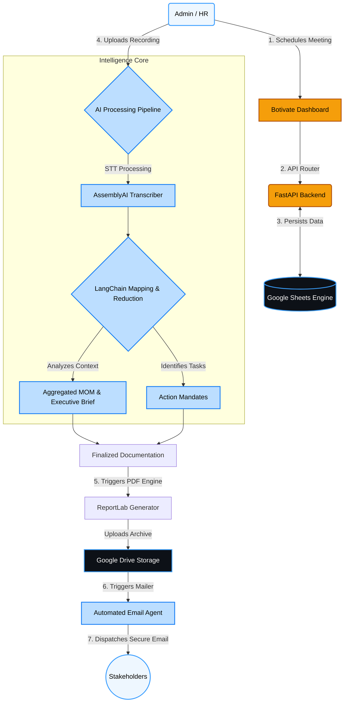

# Botivate: Agentic Minutes of Meeting (MOM) System


Botivate is an intelligent, agentic system designed to autonomously handle, analyze, and document your meeting minutes on autopilot. By leveraging cutting-edge AI capabilities (OpenAI and AssemblyAI), Botivate transforms unstructured meeting interactions into highly structured, actionable intelligence, now fully integrated with Google Workspace for seamless enterprise cloud storage.

## 🚀 Key Features

- **Agentic Summarization:** The system autonomously drafts MOMs (Minutes of Meeting), identifies key topics, and maps conversations to specific agendas using advanced LangChain LLM pipelines.
- **Flawless Speech-to-Text:** Uses AssemblyAI Cloud STT for highly accurate multilingual transcription (Hindi, English, Hinglish).
- **Intelligent Task Extraction:** Action items are automatically isolated, categorized, and assigned to respective owners without manual intervention.
- **Google Cloud Integration:** Full archival system using **Google Sheets** as a comprehensive database and **Google Drive** for secure document storage.
- **Board Resolution (BR) Management:** Specialized workflow for high-stakes resolutions with meeting-specific folder archival and governance evidence tracking.
- **Automated Notifications:** Botivate automatically sends professional summary emails, task assignments, and overdue warnings with dynamically generated, meticulously styled **PDF attachments**.
- **Rich Analytics Dashboard:** Gain deep insights into team productivity, meeting frequency trends, attendance rates, and action-item completion metrics.
- **Modern & Premium UI:** Designed with a sleek, minimalist dark/light mode interface characterized by glassmorphism, dynamic animations, and brand-consistent styling.

---

## 🧠 System Architecture & Workflow

Below is the high-level workflow of the Botivate Agentic MOM System, outlining how raw data translates into automated cloud-backed archival.



---

## 🛠 Tech Stack

### Frontend
- **React 18** + **Vite**
- **TypeScript**
- **Tailwind CSS v3** (Custom Brand System)
- **Recharts** for Analytics
- **Heroicons / Radix Icons**
- **Zustand** for State Management
- **React Query** for Data Fetching & Caching

### Backend
- **Python 3.10+**
- **FastAPI** (High-performance API framework)
- **LangChain & OpenAI API** (GPT-4o-mini for logical synthesis and mapping/reducing)
- **AssemblyAI** (For highly accurate cloud-based Audio Transcription)
- **Google Sheets API v4** (Real-time Cloud Database via Pygsheets/Google API Client)
- **Google Drive API v3** (Hierarchical Document Storage and Sharing)
- **ReportLab** (Dynamic, aesthetic PDF generation for Executive Briefing & Action items)
- **aiosmtplib** (Asynchronous Email Delivery system)

---

## 📂 Project Structure

```text
📦 MOM_AI_Assistant
 ┣ 📂 backend
 ┃ ┣ 📂 app
 ┃ ┃ ┣ 📂 ai                # Langchain logic, STT config, LLM Prompts
 ┃ ┃ ┣ 📂 api               # FastAPI route endpoints (Meetings, Analytics, Dashboard)
 ┃ ┃ ┣ 📂 models            # Enums & Pydantic validation schemas
 ┃ ┃ ┣ 📂 services          # Core logic (Google Sheets, AssemblyAI, Automation)
 ┃ ┃ ┣ 📂 notifications     # SMTP Email agent & PDF design engine 
 ┃ ┃ ┗ 📜 main.py           # Application entrypoint
 ┃ ┣ 📜 requirements.txt    # Python dependencies
 ┃ ┣ 📜 .env                # API Keys & Cloud Credentials
 ┃ ┗ 📜 google_credentials.json # Service Account Secret
 ┣ 📂 frontend
 ┃ ┣ 📂 src
 ┃ ┃ ┣ 📂 components        # Reusable UI elements (Drawers, Cards, Modals)
 ┃ ┃ ┣ 📂 pages             # Application views (Dashboard, Meeting workflows)
 ┃ ┃ ┣ 📜 App.tsx           # Router configuration
 ┃ ┃ ┗ 📜 index.css         # Global Tailwind directives & Brand tokens
 ┃ ┣ 📜 tailwind.config.js  # Deep-customized brand theme
 ┃ ┗ 📜 package.json        # Node dependencies
 ┣ 📜 README.md             # Project Overview
 ┗ 📜 SETUP.md              # Installation & Deployment instructions
```

---

## ℹ️ Setup & Installation

Please refer to the [SETUP.md](SETUP.md) file for comprehensive, step-by-step instructions on configuring your Google Cloud Project, Assembly AI, OpenAI, setting up credentials, and running Botivate locally.

---
*Botivate Services LLP © 2026. Powering Businesses On Autopilot.*